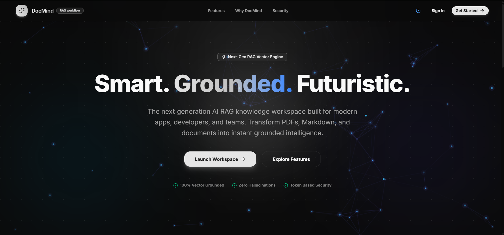
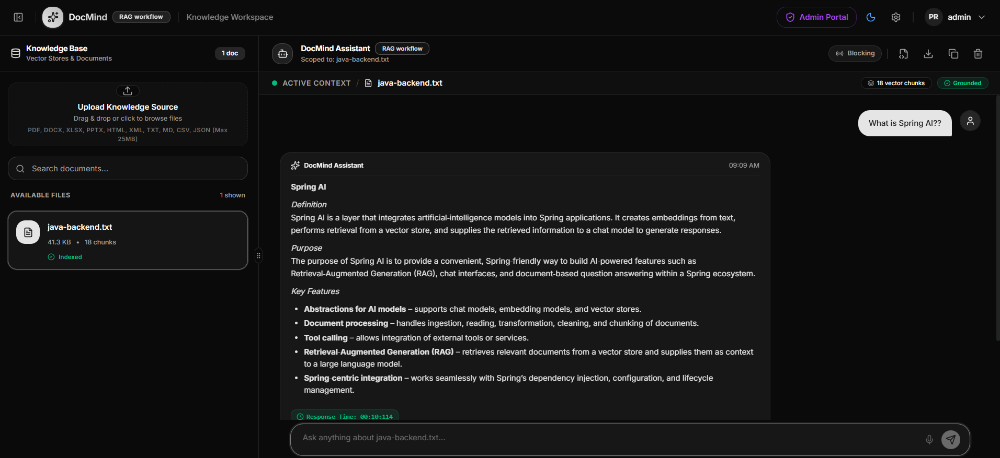
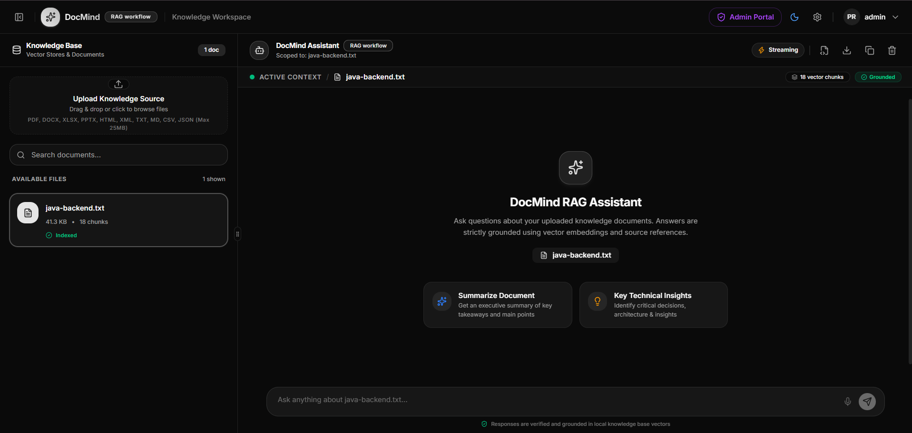
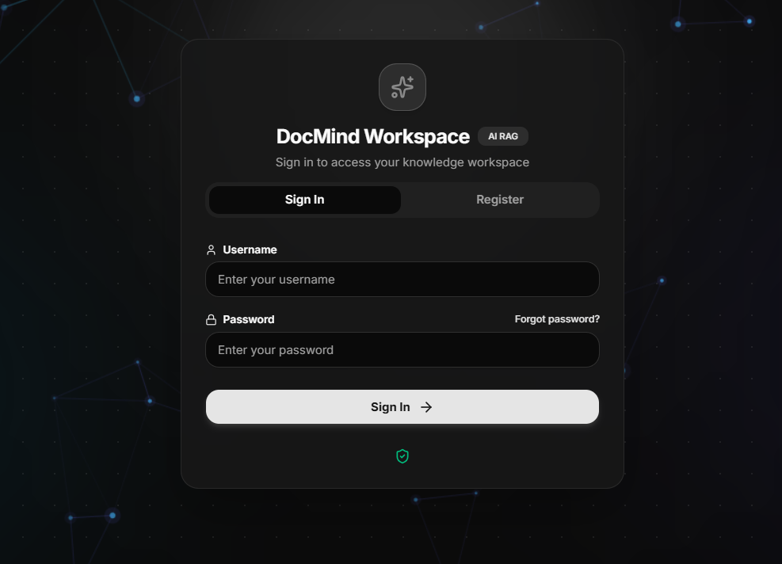

# 🧠 DocMind - Intelligent Document Analysis & RAG Platform

> **DocMind** is an enterprise-grade, end-to-end Document Intelligence and Retrieval-Augmented Generation (RAG)
> platform. Powered by Spring AI, Java 25, React 19, and vector search with Qdrant, DocMind enables seamless
> multi-format
> document ingestion, real-time AI assistant streaming queries, asymmetric RS256 security, and comprehensive
> administrative controls.

---

## 📸 Application Screenshots

Here is a visual walkthrough of DocMind's key interfaces:

### 1. 🏠 Home Workspace & Document Hub

Upload, organize, search, and manage your documents with intelligent filtering and instant status tracking.



---

### 2. 💬 AI Document Assistant & RAG Query Engine

Engage in contextual, low-latency conversations with your documents using real-time Server-Sent Events (SSE) streaming
and multi-provider LLM support (NVIDIA NIM / OpenAI).



---

### 3. 🛡️ Admin Management Portal

Manage users, monitor system accounts, and assign fine-grained Role-Based Access Control (RBAC) permissions.



---

### 4. 🔐 Secure Authentication & Session Access

Modern login flow backed by RS256 RSA asymmetric cryptography, JWT tokens, and HttpOnly secure cookies.



---

## ✨ Key Features

- 📄 **Multi-Format Document Parsing**: Ingest PDFs and unstructured documents utilizing Apache Tika and Spring AI
  readers.
- ⚡ **High-Performance Vector Retrieval**: Automatic text chunking and vector embedding storage powered by **Qdrant
  Vector DB**.
- 🌊 **Real-Time Streaming Responses**: Low-latency AI responses streamed token-by-token via Server-Sent Events
  (`/api/chat/documents/{id}/query/stream`).
- 🤖 **Multi-Provider LLM Integration**: Strategy pattern supporting NVIDIA AI / NIM foundation models and
  OpenAI-compatible providers.
- 🔐 **Asymmetric Security & JWT Auth**: RS256 encryption via RSA-2048 keypairs, HttpOnly cookies, Redis token
  blacklisting, and OTP email verification.
- 👥 **Role-Based Access Control (RBAC)**: Fine-grained permissions for `ROLE_USER` and `ROLE_ADMIN` with active user
  state control.
- 🎨 **Modern React 19 UI**: Responsive, dark-themed dashboard built with React 19, Vite, Tailwind CSS v4, Radix UI
  primitives, and Framer Motion.
- 🐳 **One-Command Docker Deployment**: Complete `docker-compose` orchestration for PostgreSQL, Qdrant, Redis, Spring
  Boot backend, and React frontend.

---

## 🏗️ System Architecture

```
                                  +-----------------------+
                                  |   React 19 Frontend   |
                                  |   (Vite + Tailwind)   |
                                  +-----------+-----------+
                                              |
                                              | HTTP / SSE Stream
                                              v
                                  +-----------------------+
                                  |  Spring Boot Backend  |
                                  |  (Java 25 + Security) |
                                  +---+-------+-------+---+
                                      |       |       |
             +------------------------+       |       +-----------------------+
             |                                |                               |
             v                                v                               v
   +-------------------+            +-------------------+           +-------------------+
   |   PostgreSQL 18   |            |   Qdrant Vector   |           |      Redis 8      |
   | (Relational Data) |            | (Embeddings DB)   |           |      (Tokens)     |
   +-------------------+            +-------------------+           +-------------------+
                                              |
                                              v
                                    +-------------------+
                                    | LLM Provider APIs |
                                    | (NVIDIA / OpenAI) |
                                    +-------------------+
```

---

## 🛠️ Technology Stack

| Domain                  | Technologies                                                                    |
|:------------------------|:--------------------------------------------------------------------------------|
| **Backend Framework**   | Java 25, Spring Boot 4.1.1, Spring Security, Spring Data JPA                    |
| **AI & RAG Engine**     | Spring AI 2.0.0, Qdrant Vector Store Advisor, Apache Tika, Spring AI PDF Reader |
| **Databases & Cache**   | PostgreSQL 18, Qdrant Vector DB, Redis 8                                        |
| **Frontend Framework**  | React 19, TypeScript, Vite 8, Tailwind CSS v4, TanStack Query v5                |
| **UI Components**       | Radix UI, Shadcn UI, Framer Motion, Lucide Icons, React Markdown                |
| **Security & Auth**     | RS256 RSA Encryption, JWT (JJWT 0.12.6), HttpOnly Cookies, Redis Token Store    |
| **DevOps & Containers** | Docker, Docker Compose, Flyway DB Migrations, Nginx                             |

---

## 🚀 Getting Started

### Prerequisites

Make sure you have the following installed on your system:

- **Docker** and **Docker Compose**
- **Java 25** (if running backend locally)
- **Node.js 22+** (if running frontend locally)
- **OpenSSL** (for RSA keypair generation)

---

### 1. Environment Configuration

Create a `.env` file in the root directory (or use the provided `.env` template):

```env
# Profile
SPRING_PROFILES_ACTIVE=

# PostgreSQL
DB_USERNAME=
DB_PASSWORD=

# Redis
REDIS_PASSWORD=

# Mail
MAIL_USERNAME=
MAIL_PASSWORD=

# AI
CHAT_KEY=
CHAT_BASE_URL=
CHAT_MODEL=

EMBEDDING_KEY=
EMBEDDING_BASE_URL=
EMBEDDING_MODEL=

REWRITE_KEY=
REWRITE_BASE_URL=
REWRITE_MODEL=

# Qdrant
QDRANT_API_KEY=
QDRANT_USE_TLS=

# Default Credentials
DEFAULT_ADMIN_USERNAME=
DEFAULT_ADMIN_PASSWORD=

#Cors
CORS_ALLOWED_ORIGIN=

# Cookies
COOKIE_HTTP_ONLY=
COOKIE_SECURE=
COOKIE_SAME_SITE=
COOKIE_DOMAIN=

# DocMind Environment
VITE_API_BASE_URL=
VITE_FRONTEND_PORT=
BACKEND_URL=
```

---

### 2. RSA Keypair & Secret Pass Generation

#### Asymmetric Key Pair (RS256 JWT Security)

Generate the public and private key files required for JWT token signing:

```bash
# Private Key Generation
openssl genpkey -algorithm RSA -out private_key.pem -pkeyopt rsa_keygen_bits:2048

# Public Key Generation
openssl rsa -pubout -in private_key.pem -out public_key.pem
```

#### Random Secret / Key Generation

Generate a 32-byte secure random hex secret key:

```bash
openssl rand -hex 32
```

---

### 3. Standalone Infrastructure Containers (Manual Setup)

If running vector DB and caching containers individually via Docker CLI:

#### Qdrant Vector DB Container:

```bash
docker run -d --name qdrant -p 6333:6333 -p 6334:6334 -e API_KEY="KEY" -v qdrant_storage:/qdrant/storage qdrant/qdrant:latest
```

#### Redis Cache & Session DB Container:

```bash
docker run -d --name my-redis -p 6379:6379 redis:latest
```

---

### 4. Docker Compose Deployment & Operations (Recommended)

#### Deployment & Lifecycle Management

```bash
# Validate and display resolved configuration
docker compose --env-file .env config

# Build images and start all containers in detached mode
docker compose --env-file .env up -d --build

# Start existing containers without rebuilding
docker compose --env-file .env up -d

# Stop and remove containers and network
docker compose --env-file .env down

# Stop containers, remove networks, and PURGE persistent database volumes
docker compose --env-file .env down -v
```

#### Service Diagnostics & Health Inspection

```bash
# View logs for a specific service (e.g. docmind, postgres, qdrant, redis, frontend)
docker compose --env-file .env logs <service>

# Inspect container health status in JSON format
docker inspect <service> --format "{{json .State.Health}}"
```

Once services are running:

- 🌐 **Frontend UI**: [http://localhost:5173](http://localhost:5173)
- ⚙️ **Backend API**: [http://localhost:8080](http://localhost:8080)
- 📚 **Swagger API Docs**: [http://localhost:8080/swagger-ui.html](http://localhost:8080/swagger-ui.html)
- 🔍 **Qdrant Dashboard**: [http://localhost:6333/dashboard](http://localhost:6333/dashboard)

---

### 5. Local Development Workflow (Without Docker)

#### Run Backend (Spring Boot)

```bash
cd docmind-backend/doc-mind
./gradlew bootRun
```

#### Run Frontend (React Vite)

```bash
cd docmind-frontend/DocMind
npm install
npm run dev
```

---

## 📡 API Reference Overview

| Endpoint                                | Method | Role       | Description                                            |
|:----------------------------------------|:-------|:-----------|:-------------------------------------------------------|
| `/api/auth/login`                       | `POST` | Public     | Authenticate user and receive RS256 JWT cookie         |
| `/api/auth/register`                    | `POST` | Public     | User self-registration with email verification         |
| `/api/documents/upload`                 | `POST` | User/Admin | Upload document for Tika parsing & vector indexing     |
| `/api/documents`                        | `GET`  | User/Admin | List user documents with pagination & keyword search   |
| `/api/chat/documents/{id}/query`        | `POST` | User/Admin | Ask AI a question about a document (standard response) |
| `/api/chat/documents/{id}/query/stream` | `POST` | User/Admin | Stream AI response in real-time via SSE                |
| `/api/admin/portal/all/users`           | `GET`  | Admin      | Fetch all registered users and assigned roles          |
| `/api/admin/portal/assign`              | `POST` | Admin      | Assign RBAC roles to users                             |

---

## 📂 Directory Structure

```
DocMind/
├── docker-compose.yaml        # Complete Docker multi-container orchestration
├── .env                       # Environment configuration template
├── Notes.md                   # Setup notes and PowerShell curl commands
├── document/                  # Documentation images & screenshots
│   ├── docmind-home.png       # Home Workspace UI
│   ├── docmind-assistant.png  # AI Assistant Chat UI
│   ├── docmind-dashboard.png  # Admin Dashboard UI
│   └── docmind-login.png      # Login Screen UI
├── docmind-backend/           # Java 25 & Spring Boot RAG Backend
│   └── doc-mind/              # Gradle project source code
└── docmind-frontend/          # React 19 & Tailwind CSS Frontend
    └── DocMind/               # Vite project source code
```

---

## 📝 Author

Developed by **Pranit Bhangale**.